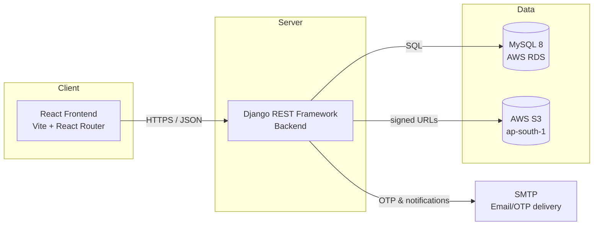

# ZAP10X Academy - System Design & Database Documentation

**Prepared for:** CEO review
**Scope:** Backend (Django/DRF + MySQL), as built to date
**Status:** Living document - reflects the codebase at the time of writing, not a future plan

---

## Table of Contents

1. [Overview](#1-overview)
2. [System Architecture](#2-system-architecture)
3. [Security & Access Control](#3-security--access-control)
4. [Database Design](#4-database-design)
5. [API Reference](#5-api-reference)
6. [Current Build Status](#6-current-build-status)

---

## 1. Overview

ZAP10X Academy is a B2B2C learning platform: universities and their affiliated colleges license the platform for their students, and individuals can also buy standalone courses directly, without going through any institution.

---

## 2. System Architecture

### 2.1 Components

- **Frontend:** React 19 + Vite + React Router. Currently uses real APIs only for login/signup/OTP; all other screens are completely static hardcoded data.
- **Backend:** Django 6 + Django REST Framework. 
- **Database:** MySQL 8, hosted on AWS RDS.
- **File storage:** AWS S3. Files are never stored in the database - MySQL keeps only the S3 object key.
- **Email:** SMTP, used to deliver OTP login codes.

### 2.2 Environments

Three environments - dev, test, prod 

---

## 3. Security & Access Control

### 3.1 Authentication - JWT, with zero server-side token storage

Login is via password **or** email OTP; both issue the same JWT pair (access + refresh token).

- **Access tokens** are short-lived (15 minutes) and fully stateless - verified by signature and expiry only, no database lookup.
- **Refresh tokens** are longer-lived and also verified by signature alone. **No table stores issued tokens.** This is a deliberate choice: it removes an entire class of database load (a write on every login) at the cost of not being able to force-revoke a single session early - logout, a role change, or a leaked token all take effect once the current access token expires (worst case: 15 minutes), not instantly. This trade-off is documented and was a deliberate decision, not an oversight.
- The authentication class (`accounts.authentication.JWTAuthentication`) is custom-built rather than using the standard library's default, specifically so it does not depend on Django's built-in user model - it loads the platform's own `User` row directly from the token's claims.

### 3.2 Passwords and OTP codes - what's hashed, what isn't

| Data | Protection |
|---|---|
| **User passwords** | Hashed with Django's `make_password` (PBKDF2 by default, industry-standard, salted). Never stored and never included in any API response |
| **OTP login codes** | Hashed with SHA-256 before storage. OTPs are 6-digit, single-use, rate-limited (max attempts, short expiry), so the brute-force threat model is different from a long-lived password. |
| **Refresh/access tokens** | Not stored anywhere. |

### 3.3 Authorization - scoped role-based access control (RBAC)

The platform does not use Django's built-in permission system. Instead:

- **Roles** (7 seeded: Super Admin, University Admin, College Admin, Faculty, Content Author, Student, Individual Learner) are granted to a user **at a specific scope** - e.g. "University Admin, scoped to VTU only" or "Faculty, scoped to one specific college."
- **Permissions** (44 seeded, e.g. `college.edit`, `course.create`, `grades.edit`) are attached to roles.
- Scopes are hierarchical: a grant at the University level automatically covers every college under that university, without a separate row per college.
- Every protected API endpoint checks a specific permission code via a shared `HasPermission(code)` check - the same logic is never duplicated per-endpoint. List endpoints additionally filter results to only the scopes the caller actually has access to, rather than returning everything and hiding rows.

---

## 4. Database Design

**31 tables total.** No migrations - every table is created and altered by hand-written SQL, applied identically to every environment.

**Universal convention:** every table has a `status` column (`1` = active, `0` = soft-deleted). Rows are never hard-deleted by the application. Because of this, natural keys (email, slug, code) are **not** database-enforced-unique - re-registering a value after its old row was soft-deleted must remain possible - so uniqueness among active rows is enforced in application code instead.

### 4.1 Table groups

**A. Organization - who studies where**
| Table | Purpose |
|---|---|
| `universities` | The accrediting/affiliating authority (e.g. Sricity International University). Does not necessarily have a physical campus of its own. |
| `colleges` | The physical institution a student actually studies at. Every SIU school (Technology & AI, Advanced Manufacturing, Business, Nova Media) is a row here, tagged `CONSTITUENT` (owned by the university). An externally affiliated college (e.g. under VTU) is tagged `AFFILIATED`. |
| `departments` | Organizational grouping under a college (e.g. "Dept of CSE") - who a faculty member reports into, not curriculum. |

**B. Identity, Authentication & Access Control**
| Table | Purpose |
|---|---|
| `users` | Every person on the platform - student, faculty, admin - one row regardless of role. Holds the hashed password. |
| `otp_codes` | Issued OTP login codes, hashed, single-use, expiring. |
| `roles`, `permissions`, `role_permissions` | The RBAC vocabulary - seeded once, not hand-edited per environment. |
| `user_role_assignments` | The actual grants: which user holds which role, at which scope. |

**C. Content Catalog - what is taught (authored once, reused everywhere)**
| Table | Purpose |
|---|---|
| `programs` | A formal degree/branch (e.g. "B.Tech Computer Science"). Authored centrally, not owned by any one college. |
| `college_programs` | Which colleges have adopted which programs. |
| `tracks` | A specialization or standalone bootcamp (e.g. "Web Development," "Full Stack Development"). Can exist independently of any program, for individual learners with no college affiliation. |
| `courses` | A subject (e.g. "Web Development (HTML, CSS)"). Global, reusable content. |
| `track_courses` | Which courses belong to which tracks, in what order. |
| `modules` | A unit within a course (e.g. "Getting Started & HTML Basics"). Also carries scheduling info (day, time of day, duration). |

**D. Content Assets & Facilitators** *(no learner-facing API yet - see §6)*
| Table | Purpose |
|---|---|
| `content_assets` | One row per uploaded file (PPTX, PDF, DOCX, image, video, audio). **Stores only the S3 object key, never the file itself.** Tracks whether an office-format file has been converted to a browser-viewable PDF preview. |
| `course_facilitators` | Which faculty members facilitate a course (a course can have several, e.g. 4 instructors on one track). |
| `glossary_terms` | Per-module glossary: term, plain-language explanation, example. |
| `code_segment_nodes` | Per-module code file tree (folders and files) shown in the in-browser code viewer. |
| `live_sessions` | Scheduled/recorded live classes per module. |
| `live_session_materials` | Files (slides, PDFs) shown during a live session. |
| `module_content_items` | Everything else a module shows: videos, podcasts, audio, slide decks, PDFs, documents, reference material. |

**A module's content, by product name.** The product defines 11 named content types per module. Some map directly onto tables already listed above; the rest are **not yet started** - no tables exist for them yet, this is a plan, not a build:

| Product name | Maps to | Status |
|---|---|---|
| Video (Live Sessions) | `live_sessions` / `live_session_materials` | Built |
| Podcasts | `module_content_items` | Built |
| Resources (Code Segments) | `code_segment_nodes` | Built |
| Jargon Wagon (Glossary) | `glossary_terms` | Built |
| Shorts | `module_content_items` (needs a new content type added) | **Not yet started** |
| Lesson Deck | The module's primary teaching content - one per module, not an item among several | **Not yet started** |
| Quizzes | Practice questions, ungraded, unlimited attempts | **Not yet started** |
| Tests | Graded, timed, limited attempts | **Not yet started** |
| Assignments | Open-ended submission, manually graded by faculty | **Not yet started** |
| IIP (Industry Integrated Project) | Capstone project: requirements, submission, industry-partner grading | **Not yet started** |
| Sidebar | Threaded discussion/doubt-clarification per module (a Discord-style forum) | **Not yet started** |

**E. Cohorts, Teaching & Enrollment**
| Table | Purpose |
|---|---|
| `cohorts` | A batch - either an institutional batch (college + program) or an open bootcamp batch (track only, no college). |
| `student_profiles`, `faculty_profiles` | One row per student/faculty user, holding role-specific fields. |
| `student_college_enrollments` | Which student is enrolled at which college - a many-to-many relationship, since a student can be enrolled at more than one college at once. |
| `faculty_college_affiliations` | Which faculty member teaches at which college - also many-to-many, to support visiting faculty across multiple colleges. |
| `course_offerings` | A scheduled instance of a course: specific college, cohort, term, instructor. |
| `track_enrollments`, `enrollments` | Track-level and course-level enrollment records - the rows progress is tracked against. |
| `module_progress` | Per-student, per-module completion tracking. |

### 4.2 What data is sensitive, and how it's protected

| Column | Protection | Ever returned by an API? |
|---|---|---|
| `users.password_hash` | PBKDF2 (adaptive, salted) | No |
| `otp_codes.code_hash` | SHA-256 | No |
| `content_assets.file_key` | S3 object key only, bucket is private | Only as a short-lived signed URL, issued after a permission check - never a permanent public link |
| Access/refresh JWTs | Not stored in the database at all | N/A |

### 4.3 Why organization and curriculum are kept separate

If `programs`/`tracks`/`courses` were owned by a specific college, the same course would need to be duplicated across every college that teaches it, and editing it once would not propagate. Instead, content is authored centrally and colleges *adopt* it through join tables (`college_programs`, `track_courses`). This is also what makes SIU's four schools work cleanly as ordinary `colleges` rows - no separate "school" concept was needed.

### 4.4 File storage design

No file (PPTX, PDF, image, video, code file) is ever stored inside MySQL. Every file lives in S3; the database holds only its object key, relative to an environment-specific prefix (`dev/academy` for dev/test, `campuslife/academy` for prod), so the same rows are portable across environments. The application issues short-lived signed URLs on request, after checking the requester's login and permissions - the bucket itself is never public.

---

## 5. API Reference

### 5.1 Authentication (`/api/auth/`) - app: `accounts`

| Method | Path | View class | Auth required |
|---|---|---|---|
| POST | `/signup/` | `SignupView` | No |
| POST | `/login/` | `LoginView` | No |
| POST | `/otp/request/` | `OtpRequestView` | No |
| POST | `/otp/verify/` | `OtpVerifyView` | No |
| POST | `/refresh/` | `RefreshView` | No (valid refresh token required) |
| GET | `/me/` | `MeView` | Yes |

All six are hand-written `APIView` classes (not generic CRUD views), since authentication has its own request/response shape.

### 5.2 Organizations (`/api/organizations/`) - app: `organizations`

| Method | Path | View class | What it's for |
|---|---|---|---|
| GET / POST | `/universities/` | `UniversityListCreateView` | List universities on the platform, or register a new one |
| GET / PATCH / DELETE | `/universities/{id}/` | `UniversityDetailView` | View, update, or deactivate one university |
| GET / POST | `/colleges/` | `CollegeListCreateView` | List colleges/schools, or add a new one under a university |
| GET / PATCH / DELETE | `/colleges/{id}/` | `CollegeDetailView` | View, update, or deactivate one college |
| GET / POST | `/departments/` | `DepartmentListCreateView` | List departments within a college, or add a new one |
| GET / PATCH / DELETE | `/departments/{id}/` | `DepartmentDetailView` | View, update, or deactivate one department |

### 5.3 Catalog (`/api/catalog/`) - app: `catalog`

| Method | Path | View class | What it's for |
|---|---|---|---|
| GET / POST | `/programs/` | `ProgramListCreateView` | List degree programs, or create a new one |
| GET / PATCH / DELETE | `/programs/{id}/` | `ProgramDetailView` | View, update, or deactivate one program |
| GET / POST | `/college-programs/` | `CollegeProgramListCreateView` | List which colleges offer which programs, or link a college to a program |
| GET / PATCH / DELETE | `/college-programs/{id}/` | `CollegeProgramDetailView` | View, update, or remove a college-program link |
| GET / POST | `/tracks/` | `TrackListCreateView` | List tracks (specializations or standalone bootcamps), or create a new one |
| GET / PATCH / DELETE | `/tracks/{id}/` | `TrackDetailView` | View, update, or deactivate one track |
| GET / POST | `/track-courses/` | `TrackCourseListCreateView` | List which courses belong to a track, or add a course to a track |
| GET / PATCH / DELETE | `/track-courses/{id}/` | `TrackCourseDetailView` | View, update, or remove a course from a track |
| GET / POST | `/courses/` | `CourseListCreateView` | List courses, or create a new one |
| GET / PATCH / DELETE | `/courses/{id}/` | `CourseDetailView` | View, update, or deactivate one course |
| GET / POST | `/modules/` | `ModuleListCreateView` | List modules within a course, or add a new one |
| GET / PATCH / DELETE | `/modules/{id}/` | `ModuleDetailView` | View, update, or deactivate one module |

### 5.4 Shared building blocks used by every endpoint above

| Class / function | Role |
|---|---|
| `accounts.authentication.JWTAuthentication` | Verifies the bearer token and loads the requesting user, on every authenticated request |
| `rbac.permissions.HasPermission(code)` | A reusable permission-class factory - one line grants an endpoint a required permission code |
| `rbac.services.has_permission()` | Resolves whether a user holds a permission, walking up the scope hierarchy (college → university) |
| `common.models.SoftDeleteModel` | Base class every model inherits - provides the `status` soft-delete field and a manager that excludes deleted rows by default |

---

## 6. Current Build Status

### 6.1 Backend - Done

- Account signup, login, and email OTP login
- University, college, and department management
- Full content catalog: programs, tracks, courses, modules (create/edit/list/view)
- Scoped role-based access control (§3.3) enforced on every endpoint above
- Database modeled for the full platform, including tables not yet exposed via API (see 6.2)

### 6.2 Backend - TODO

- **People API** - student profiles, faculty profiles, college enrollments, faculty affiliations (tables already exist, no endpoints yet)
- **Module content API** - glossary (Jargon Wagon), code segments (Resources), live sessions (Video), podcasts (tables already exist, no endpoints yet)
- **Shorts** - short-form video, no table yet
- **Lesson Deck** - each module's primary teaching content, no table yet
- **Quizzes** - practice questions, ungraded, unlimited attempts - no table yet
- **Tests** - graded, timed, limited attempts - no table yet
- **Assignments** - open-ended submission, manually graded by faculty - no table yet
- **IIP (Industry Integrated Project)** - capstone project with requirements, submission, and industry-partner grading - no table yet
- **Sidebar** - threaded per-module discussion/doubt-clarification (Discord-style) - no table yet
- Attendance, certificates, and billing/licensing

### 6.3 Frontend - Done

- Login, signup, and OTP screens, wired to the real backend

### 6.4 Frontend - TODO

- Everything beyond login/signup/OTP is still running on STATIC mock data, not the real backend
- Integrating Backend APIs

